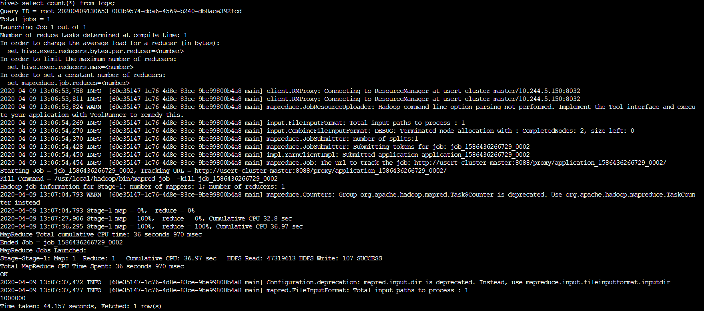
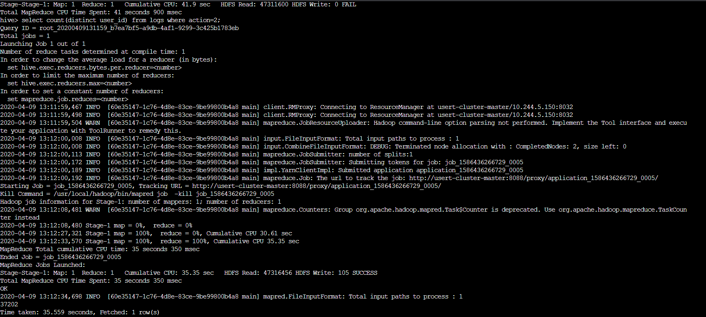

# Hive Demo

- 选择带有hive的镜像创建集群后进入terminal，输入<font color="blue">hive</font>进入Hive的命令行界面，输入<font color="blue">show tables;</font> 显示<font color="red">OK</font>表明Hive正常启动。


- 输入如下命令创建表:
```mysql
create table logs(
       user_id int,item_id int,cat_id int,mer_id int,brand_id int,month int,day int,action int,age_range int,gender int,province string)
       row format serde 'org.apache.hadoop.hive.serde2.OpenCSVSerde' 
       WITH SERDEPROPERTIES( "separatorChar"="," )  STORED AS TEXTFILE; 
```


- 输入如下命令从csv文件导入到创建的表中:
```mysql
load data local inpath '/workspace/dataset1/million_user_log.csv' overwrite into table logs; 
```


- 输入如下命令测试导入成功:
```mysql
select count(*) from logs;
```


   <font color="blue">返回执行结果为1000000条</font><br/>

- 查询记录：action为2的user数量，输入命令如下:
```mysql 
select count(distinct user_id) from logs where action=2;
```
