# Spark Demo (Python)

- 在Jupyter Notebook中编写计算Pi的Python代码

```python
from __future__ import print_function

import sys
from random import random
from operator import add

from pyspark.sql import SparkSession


if __name__ == "__main__":
    """
        Usage: pi [partitions]
    """
    spark = SparkSession\
        .builder\
        .appName("PythonPi")\
        .getOrCreate()

    partitions = int(sys.argv[1]) if len(sys.argv) > 1 else 2
    n = 100000 * partitions

    def f(_):
        x = random() * 2 - 1
        y = random() * 2 - 1
        return 1 if x ** 2 + y ** 2 <= 1 else 0

    count = spark.sparkContext.parallelize(range(1, n + 1), partitions).map(f).reduce(add)
    print("Pi is roughly %f" % (4.0 * count / n))

    spark.stop()

```
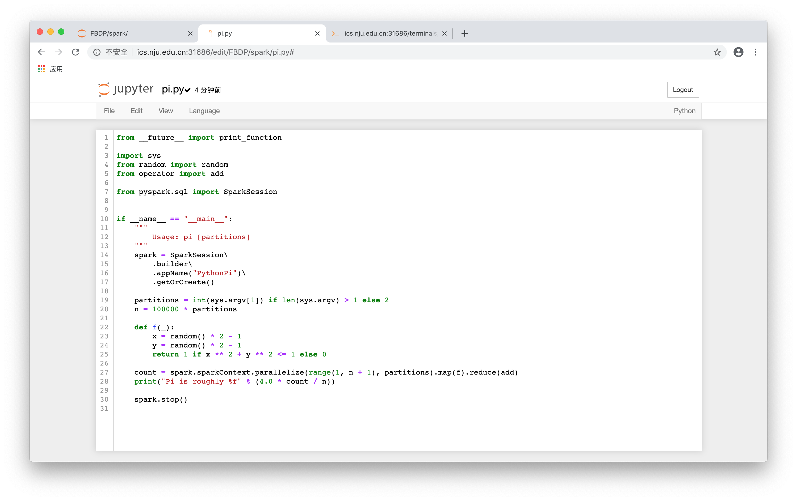


- 使用<font color="blue">spark-submit</font>执行代码（可以提交本地或集群执行，下图示例为本地执行）

```
$ spark-submit /workspace/FBDP/spark/pi.py 10
```
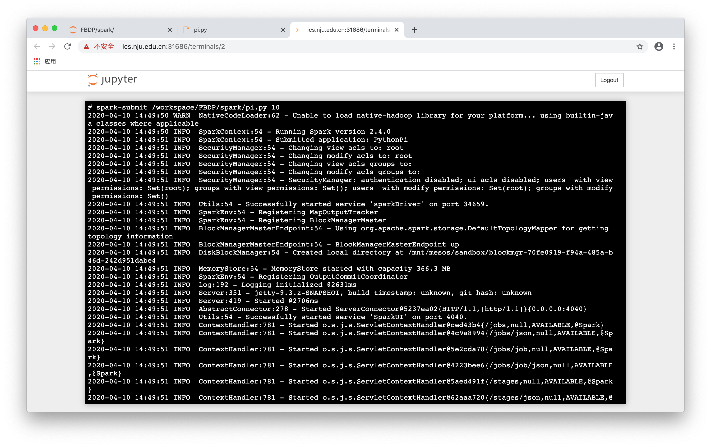

- 程序执行时在“工作区—监控”页面可以查看任务状态、日志等


- 检查输出

```
Pi is roughly 3.139400
```


# Spark Demo (Java)

- 创建Maven项目（推荐在Vscode里用Maven管理Java项目）

   - pom.xml片段，添加相关依赖包（**版本仅供参考**）

```xml
    <!-- https://mvnrepository.com/artifact/org.apache.spark/spark-core -->
    <dependency>
      <groupId>org.apache.spark</groupId>
      <artifactId>spark-core_2.11</artifactId>
      <version>2.2.1</version>
    </dependency>
    <!-- https://mvnrepository.com/artifact/org.apache.spark/spark-sql -->
    <dependency>
      <groupId>org.apache.spark</groupId>
      <artifactId>spark-sql_2.11</artifactId>
      <version>2.2.1</version>
    </dependency>
```
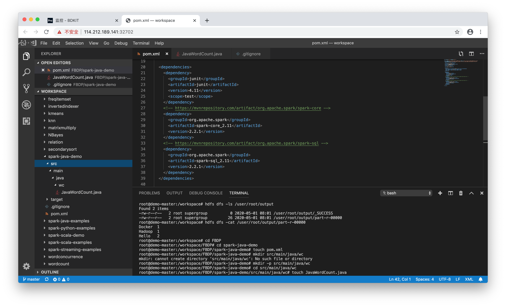


- 编写Word Count代码

```java
package wc;

import scala.Tuple2;

import org.apache.spark.api.java.JavaPairRDD;
import org.apache.spark.api.java.JavaRDD;
import org.apache.spark.sql.SparkSession;

import java.util.Arrays;
import java.util.List;
import java.util.regex.Pattern;

public class JavaWordCount {
    private static final Pattern SPACE = Pattern.compile(" ");

    public static void main(String[] args) throws Exception {

        if (args.length < 1) {
            System.err.println("Usage: JavaWordCount <file>");
            System.exit(1);
        }

        SparkSession spark = SparkSession.builder().appName("JavaWordCount").getOrCreate();

        JavaRDD<String> lines = spark.read().textFile(args[0]).javaRDD();

        JavaRDD<String> words = lines.flatMap(s -> Arrays.asList(SPACE.split(s)).iterator());

        JavaPairRDD<String, Integer> ones = words.mapToPair(s -> new Tuple2<>(s, 1));

        JavaPairRDD<String, Integer> counts = ones.reduceByKey((i1, i2) -> i1 + i2);

        List<Tuple2<String, Integer>> output = counts.collect();
        for (Tuple2<?, ?> tuple : output) {
            System.out.println(tuple._1() + ": " + tuple._2());
        }
        spark.stop();
    }
}

```
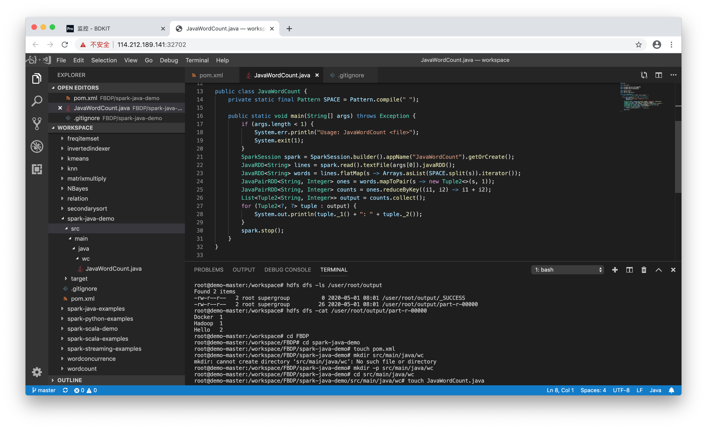


- 执行mvn package，编译并打包

```
$ mvn package
```

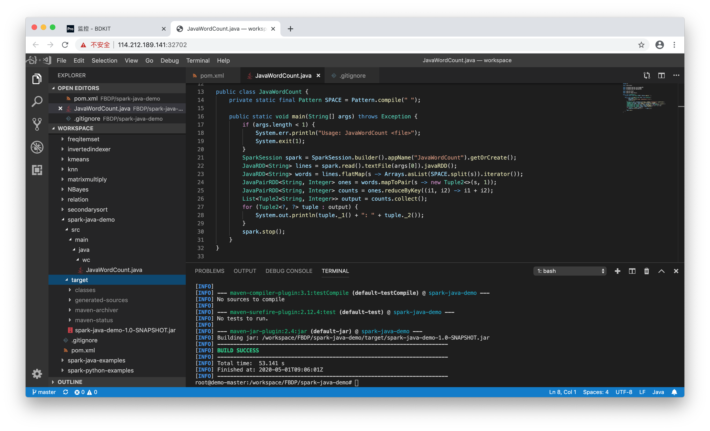


- 提交到集群运行Word Count程序
```
    spark-submit \
     --class "wc.JavaWordCount" \
     --master spark://demo-master:7077 \
     target/spark-java-demo-1.0-SNAPSHOT.jar \
     hdfs://demo-master:9000/user/root/input/file1.txt
```
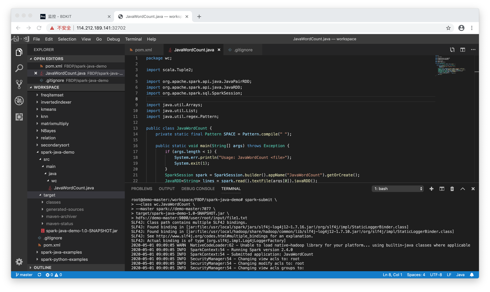

- 程序执行时在“工作区—监控”页面可以查看任务状态、日志等
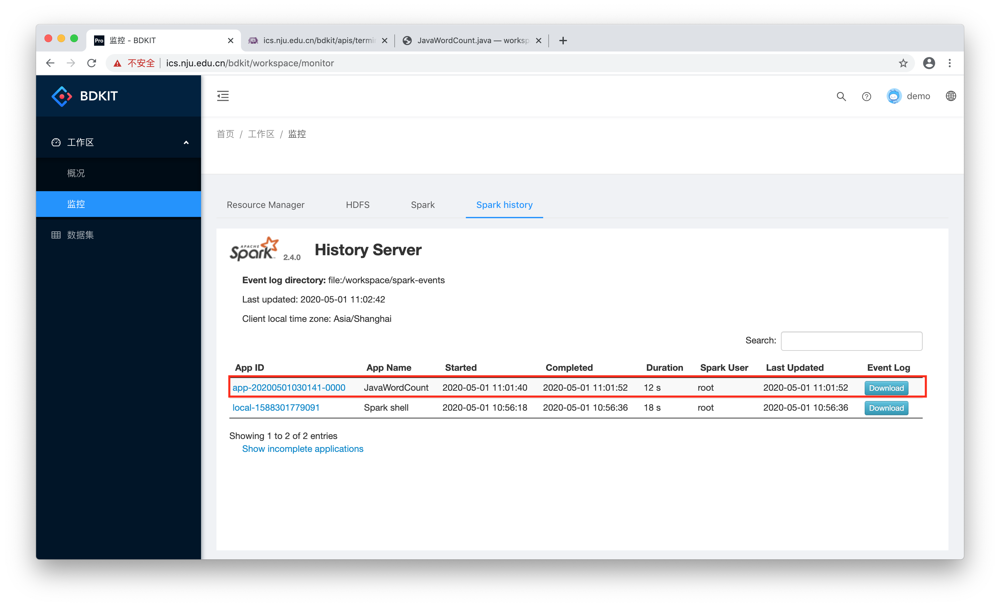

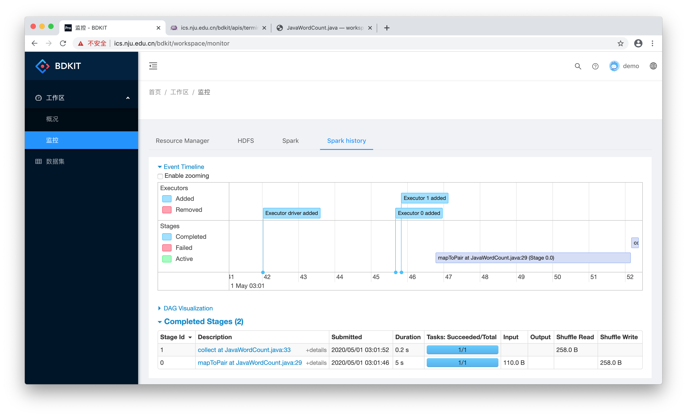

- 查看运行结果
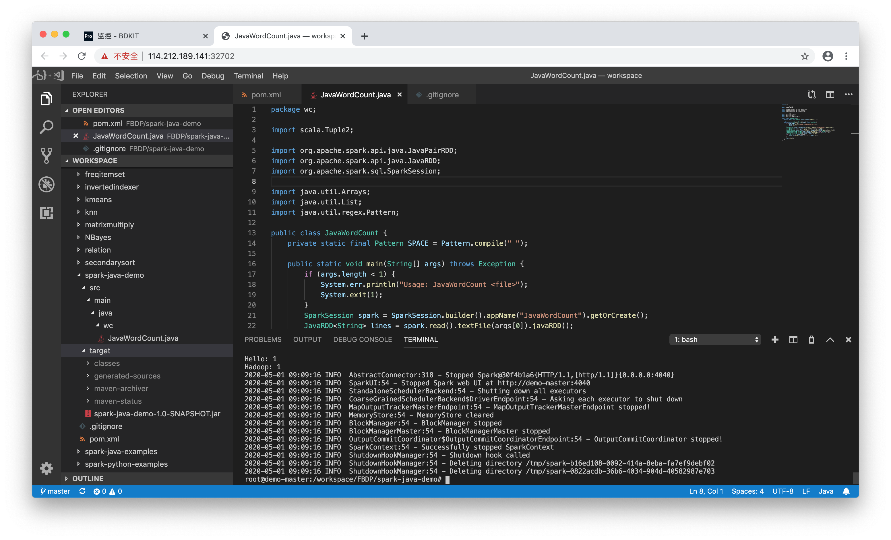


# Spark Demo (Scala)

- 编写build.sbt文件（**版本仅供参考**）

```
name := "Spark Scala Demo"
version := "1.0"
scalaVersion := "2.11.12"
libraryDependencies += "org.apache.spark" %% "spark-sql" % "2.4.0"
``` 
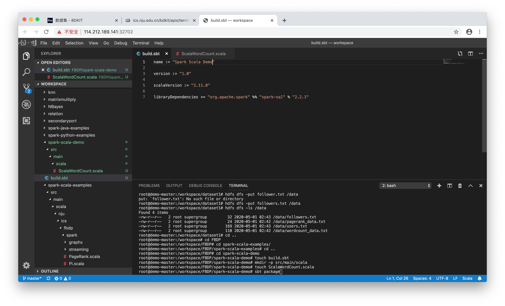

- 编写Word Count代码

```Scala
import org.apache.spark.SparkConf
import org.apache.spark.SparkContext
import org.apache.spark.SparkContext._

object ScalaWordCount {
   def main(args: Array[String]) {
     if (args.length < 1) {
       System.err.println("Usage: <file>")
       System.exit(1)
     }

     val conf = new SparkConf().setAppName("Scala_WordCount_Demo")
     val sc = new SparkContext(conf)
     val line = sc.textFile(args(0))
 
     line.flatMap(_.split(" ")).map((_, 1)).reduceByKey(_+_).collect().foreach(println)
  
     sc.stop()
   }
}
```
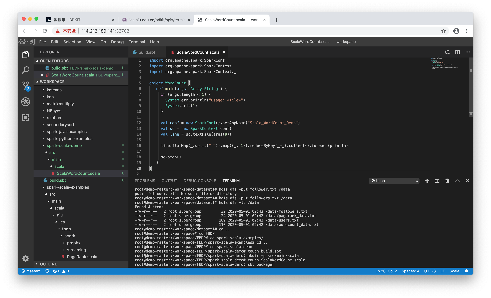


- 执行sbt package，编译并打包

```
$ sbt package
```


- 提交到集群运行Word Count程序
```
    spark-submit \
     --class "ScalaWordCount" \
     --master spark://demo-master:7077 \
     target/scala-2.11/spark-scala-demo_2.11-1.0.jar \
     hdfs://demo-master:9000/user/root/input/file1.txt
```
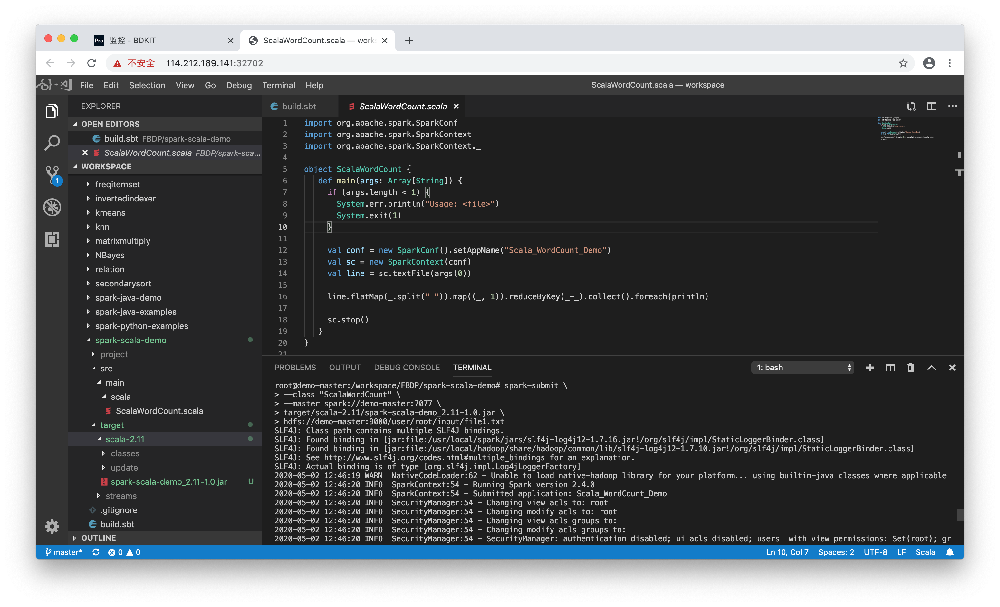

- 程序执行时在“工作区—监控”页面可以查看任务状态、日志等
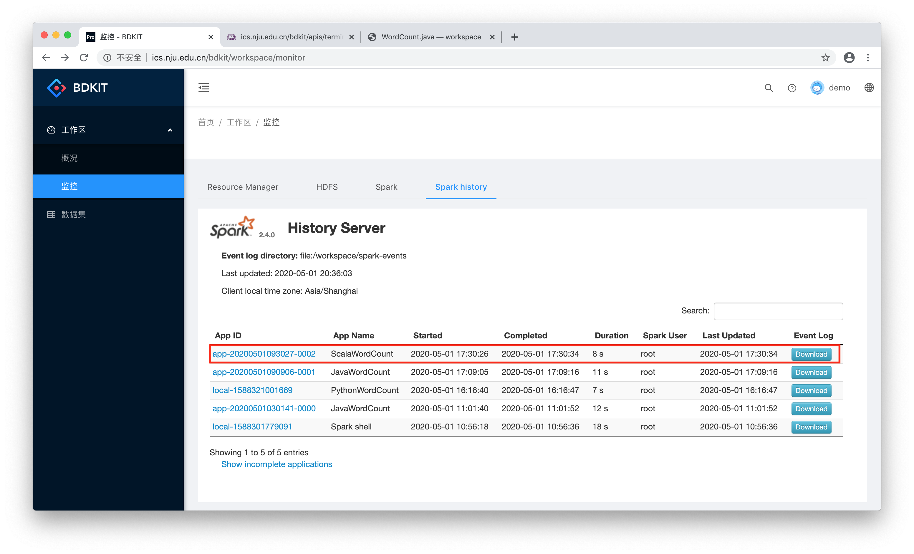
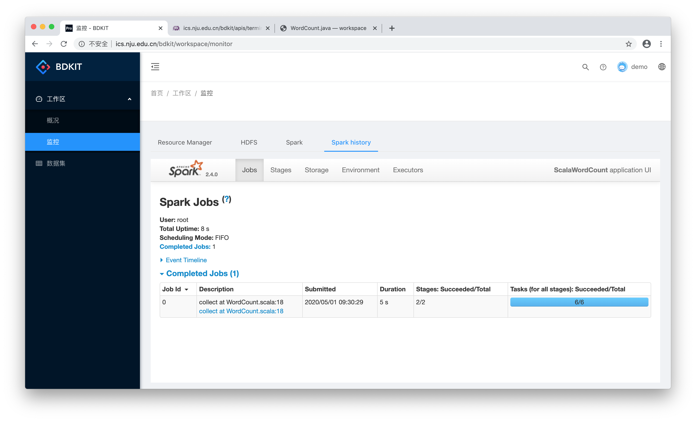
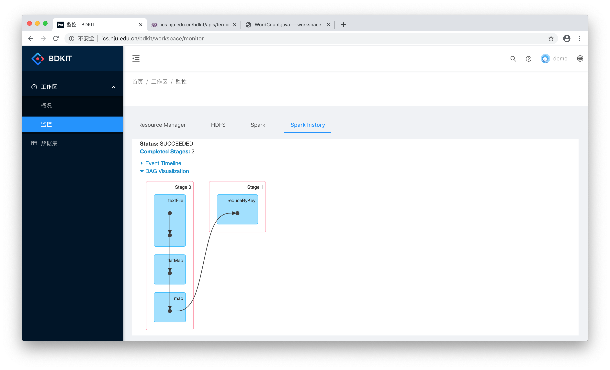

- 查看运行结果
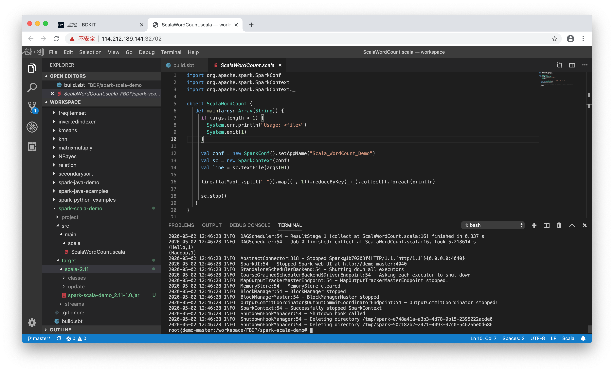
