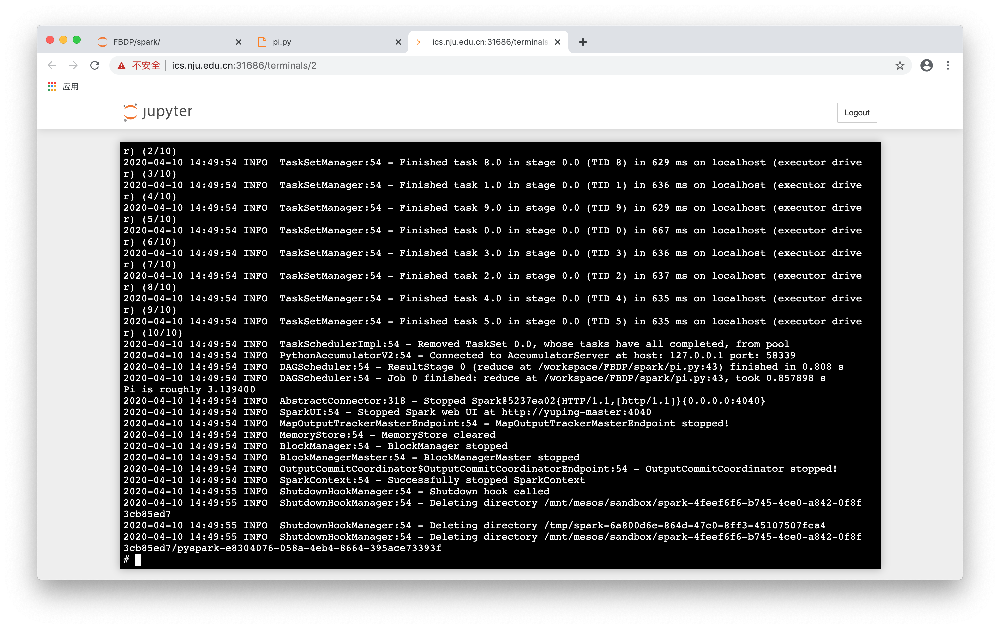

# Spark Demo (Python)

- 编写计算Pi的Python代码

```python
from __future__ import print_function

import sys
from random import random
from operator import add

from pyspark.sql import SparkSession


if __name__ == "__main__":
    """
        Usage: pi [partitions]
    """
    spark = SparkSession\
        .builder\
        .appName("PythonPi")\
        .getOrCreate()

    partitions = int(sys.argv[1]) if len(sys.argv) > 1 else 2
    n = 100000 * partitions

    def f(_):
        x = random() * 2 - 1
        y = random() * 2 - 1
        return 1 if x ** 2 + y ** 2 <= 1 else 0

    count = spark.sparkContext.parallelize(range(1, n + 1), partitions).map(f).reduce(add)
    print("Pi is roughly %f" % (4.0 * count / n))

    spark.stop()

```


- 使用<font color="blue">spark-submit</font>执行代码

```
$ spark-submit /workspace/FBDP/spark/pi.py 10
```


- 检查输出

```
Pi is roughly 3.139400
```


