# Programming

#### 编写和运行MapReduce/Spark程序

### 在Vscode中编写和运行程序

1. 点击图标访问Master节点的Vscode容器。
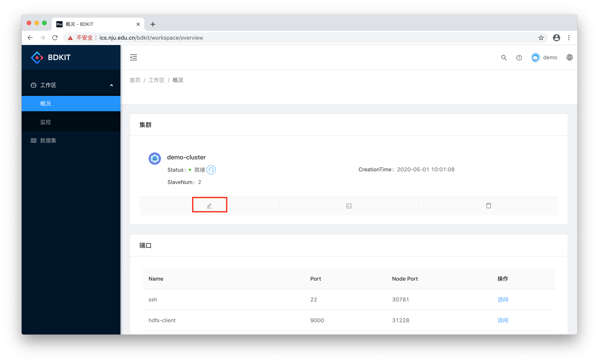

2. 在workspace中可以看到共享区中的数据集和从Git仓库中clone的代码。
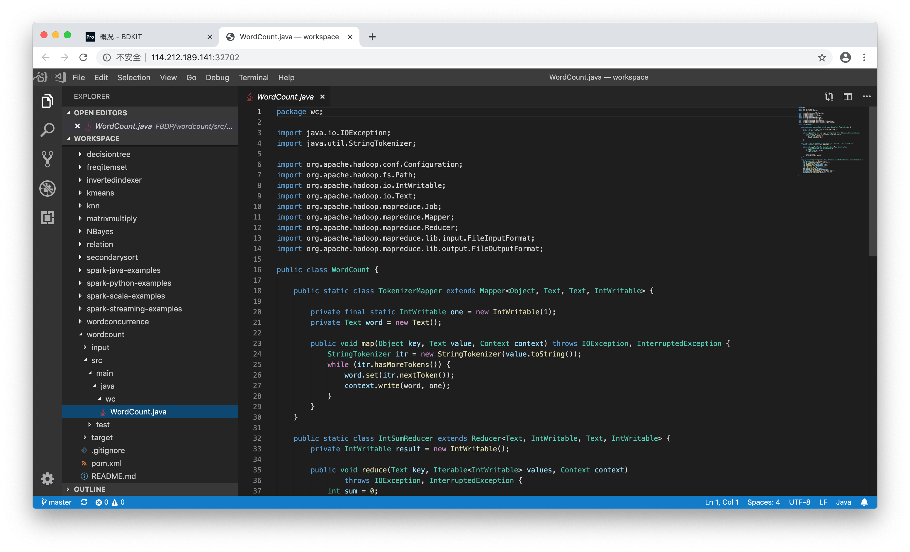

3. 在Vscode Terminal中将数据集上传至HDFS并执行程序。

4. 程序执行成功后将结果文件从HDFS下载至workspace。

5. 在“工作区—监控”页面可以监控集群状态，查看任务日志等。

### 在终端编写和运行程序

1. 点击图标访问集群Master节点的终端。
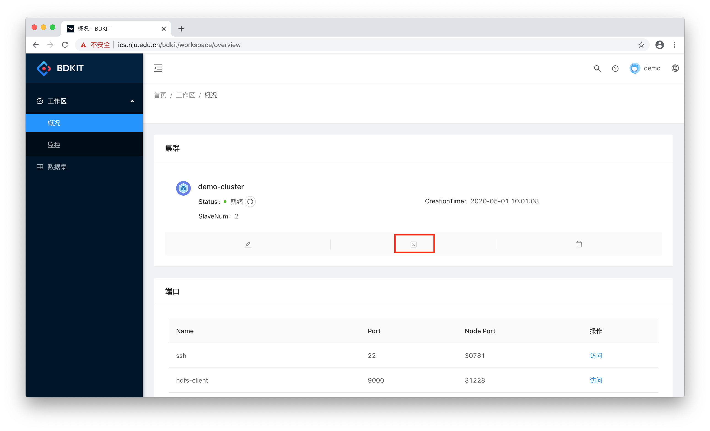

2. 用vi编写程序
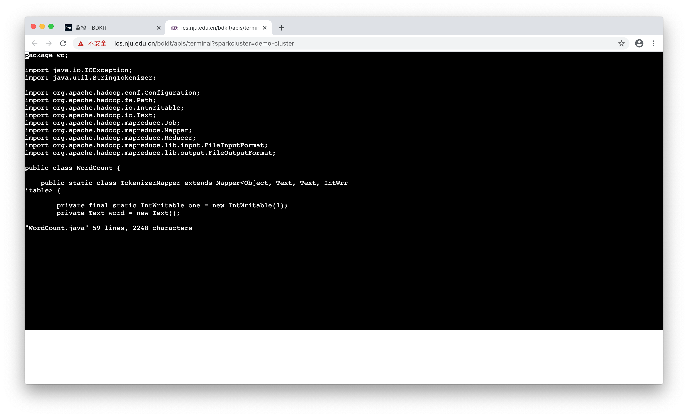

3. 运行程序
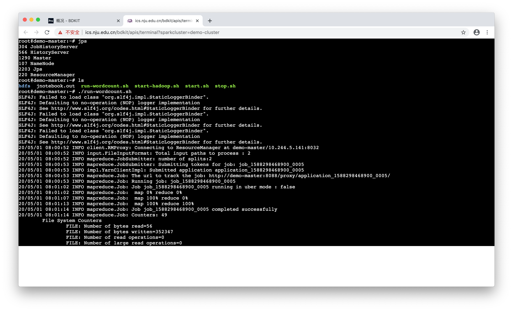

4. 查看结果
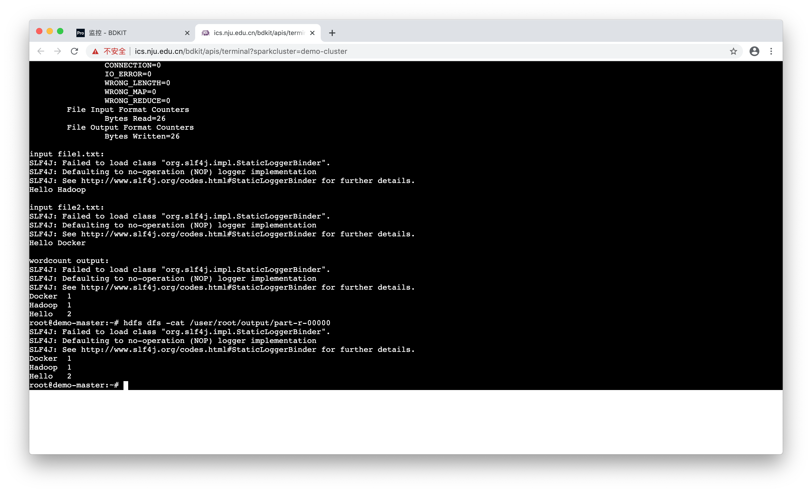

### 在Jupyter Notebook中编写和运行程序

1. 访问Jupyter Notebook的端口，默认密码123456
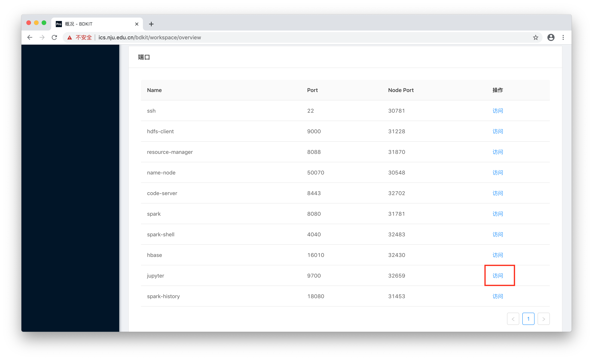
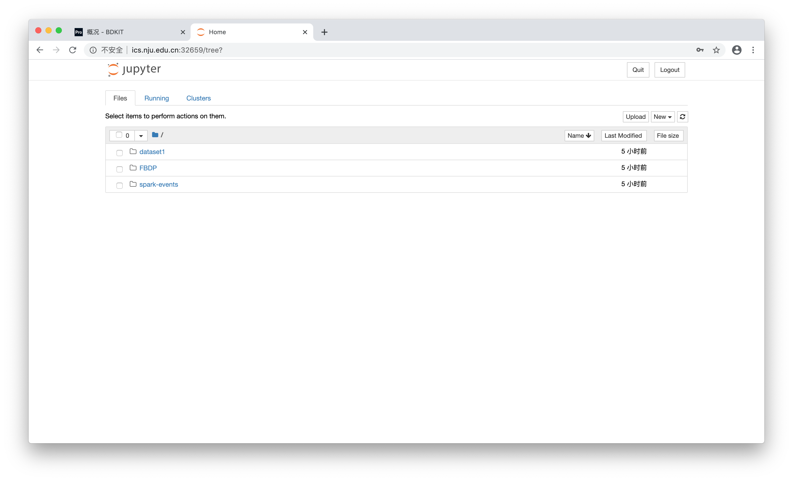

2. 编写程序
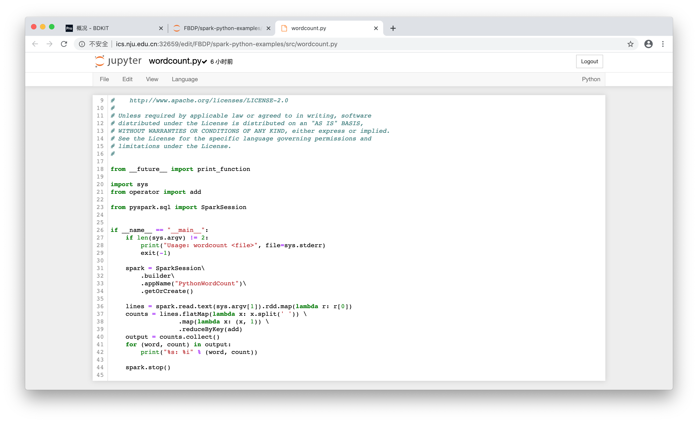

3. 新建Terminal
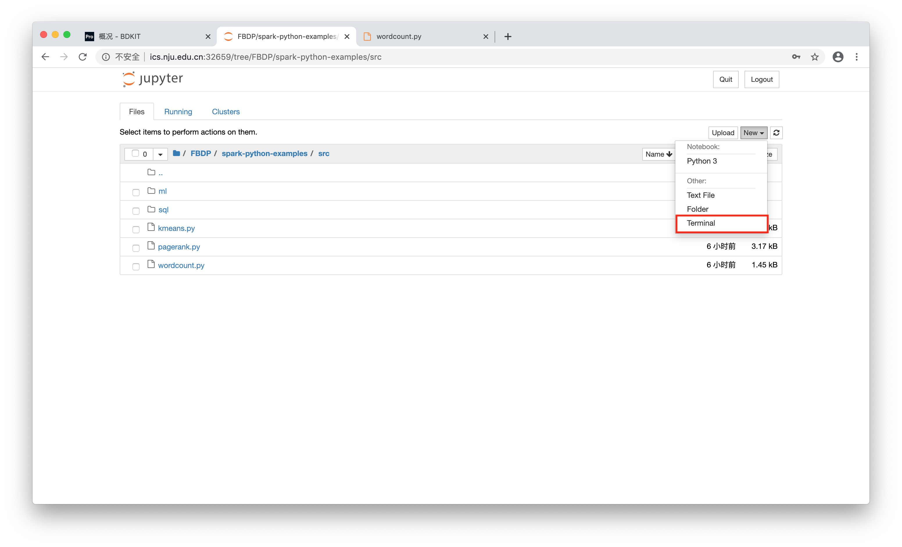

4. 执行Spark程序
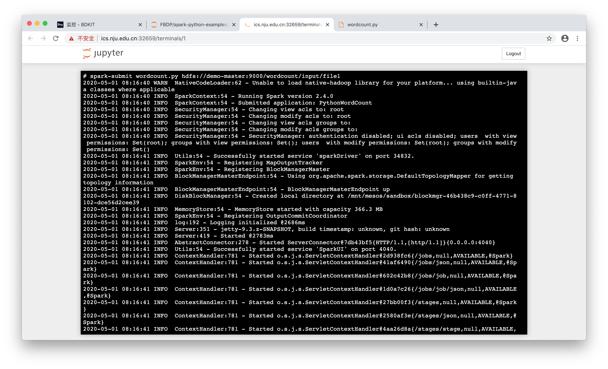

5. 查看程序执行结果
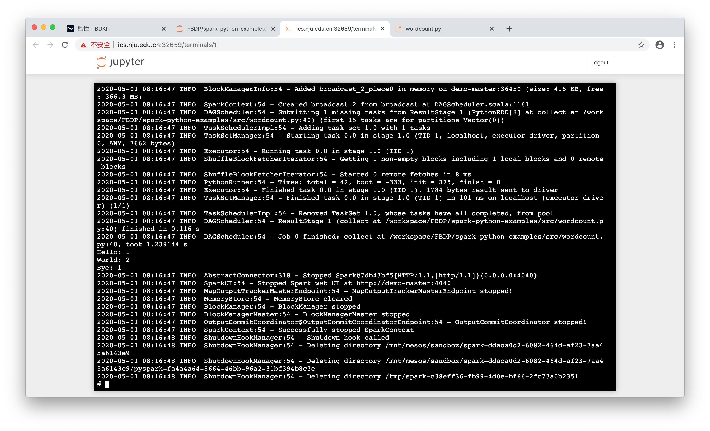

6. 关闭Terminal

